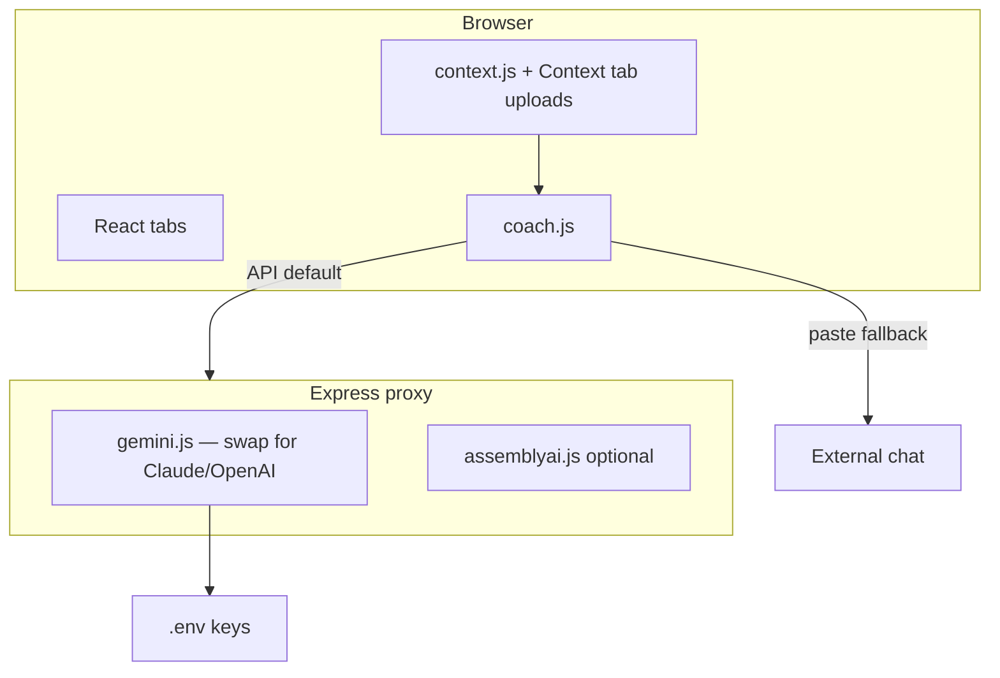

# Interview Prep Kit

Hi. I built this to fix my own interview prep workflow.

I was juggling notes in Google Docs, practice questions in Claude, prep docs somewhere else — and constantly context-switching between all of it. Every Claude session I had to re-explain which job I was interviewing for and hope I was in the right project.

So I built this instead. One place for everything, always grounded in your resume and the actual job. I put it together in under 24 hours on Cursor to prep for an interview and found it genuinely useful — so here it is.

This is a **local-first** interview prep app. Add your resume, job description, notes, and stories — it generates stage-by-stage prep docs, behavioral flashcards, an audio record-and-coach loop, a chat advisor, and interview recording transcription.

You bring your own API keys. Nothing leaves your machine. Feel free to build it out locally and try it for yourself.

## Demo

Here's the app in action — persona is a Product Quality Analyst role (with *The Office* characters as interviewers because why not).

<video src="https://github.com/user-attachments/assets/02873ec3-0298-4550-b8a3-9a59603ed658" controls width="100%"></video>

Try it with sample data:

```bash
npm run demo:setup
npm run dev
```

See [`demo/DEMO.md`](demo/DEMO.md) for what's pre-loaded.

---

## What's in the app

| Tab | What it does |
|-----|--------------|
| **Prep Docs** | One doc per interview stage — editable, regeneratable on demand |
| **Flashcards** | Behavioral deck with AI coaching on your answers |
| **Audio** | Record answers → transcribe → score your structure and delivery |
| **Advisor** | Multi-turn chat that proposes flashcards and context updates |
| **Context** | Paste, upload, or toggle your grounding materials |

---

## Quick start

Get a free [Gemini API key](https://aistudio.google.com/apikey) first (required). AssemblyAI is optional.

```bash
git clone https://github.com/badro98/interview-prep-kit.git
cd interview-prep-kit
npm install
cp .env.example .env
# Paste your Gemini key into .env
npm run dev
```

Open the local URL printed in your terminal in **Chrome** (required for Web Speech API in the Audio tab).

Check the proxy is up: http://localhost:3001/api/health

---

## API keys

No keys are included. Sign up with the providers below and paste them into `.env`.

| Variable | Required? | Get a key | Purpose |
|----------|-----------|-----------|---------|
| `GEMINI_API_KEY` | **Yes** | [Google AI Studio](https://aistudio.google.com/apikey) | Chat, coaching, audio scoring, transcription fallback |
| `GEMINI_MODEL` | Optional | — | Default: `gemini-2.5-flash` |
| `ASSEMBLYAI_API_KEY` | Optional | [AssemblyAI](https://www.assemblyai.com/dashboard/signup) | Speaker labels on large interview recordings (>25 MB) |
| `PORT` | Optional | — | Proxy port (default `3001`) |

Both offer generous free tiers — more than enough for interview prep.

**Never commit `.env`** — it's gitignored.

### Swap providers (Claude, ChatGPT, etc.)

The server is wired for Gemini by default ([`server/gemini.js`](server/gemini.js)), but it's a small proxy (~30 lines in [`server/index.js`](server/index.js)). All coaching flows through one `coach()` function in [`src/lib/coach.js`](src/lib/coach.js) — change the server client, not every feature.

---

## Adding your context

You don't need a fixed set of files. Three ways to add your materials:

1. **Context tab** — paste notes, upload `.md` / `.txt`, or add custom entries (saved in your browser)
2. **Edit `context/`** — any markdown files; restart `npm run dev` after changes
3. See [`context/README.md`](context/README.md) for a full guide to the starter templates

Every AI feature prepends your active context. Better stories → better coaching.

---

## Customizing for your interview

1. Add your context (see above)
2. Edit [`interview.config.js`](interview.config.js) — set the app title, role, company, your name, and interview stages
3. Run the drop-in prompt in [PROMPT.md](./PROMPT.md) inside Cursor, Claude Code, or Codex to regenerate prep docs and flashcards
4. Restart `npm run dev` after editing files in `context/` or `generated/` (Vite bundles them at build time)

---

## Paste mode

If you don't want to run the proxy or use API keys, toggle **AI: Paste mode** in the header. It copies a full prompt to your clipboard — paste it into any chat, paste the response back. Most people will use API mode.

Frontend only (no proxy): `npm run dev:frontend`

---

## Project structure

```
interview-prep-kit/
├── context/              # Optional starter templates + README
├── generated/            # Seed prep docs + flashcards (customize via PROMPT.md)
├── interview.config.js   # App title, stages, advisor prompt
├── server/               # Local proxy — calls your Gemini key
├── src/                  # React app
├── .env.example
└── PROMPT.md
```

---

## npm scripts

| Script | What it does |
|--------|--------------|
| `dev` | Vite + Express proxy (default — use this) |
| `dev:frontend` | Vite only, no proxy (paste mode fallback) |
| `demo:setup` | Load sample data |
| `build` | Production bundle → `dist/` |
| `preview` | Preview production build |
| `server` | Run proxy only |

---

## Architecture



---

## License

MIT — see [LICENSE](./LICENSE).
