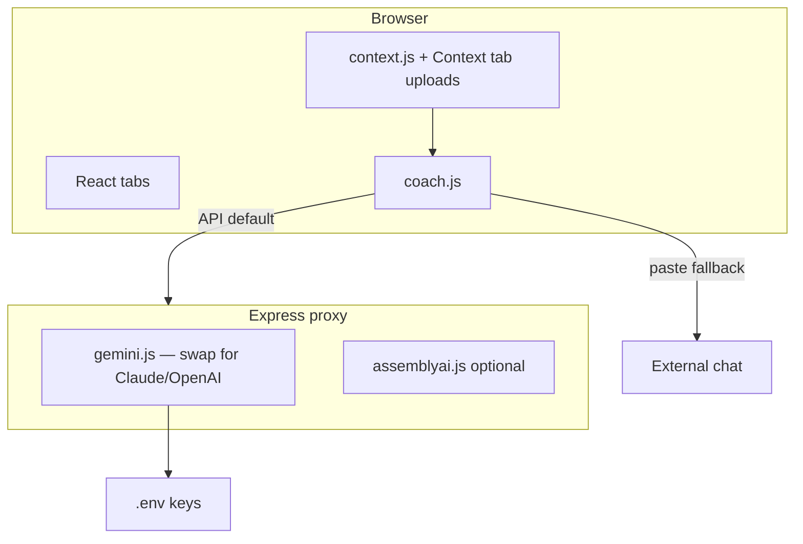

# Interview Prep Kit

A **local-first** interview prep app. Add your resume, job description, notes, and stories — it generates stage-by-stage prep docs, behavioral flashcards, an audio record-and-coach loop, a prep advisor chat, and interview recording transcription. All grounded in **your** materials, not generic advice.

**You bring your own API keys.** This repo does not include any. Coaching runs through a small local proxy on your machine; by default it calls **Google Gemini** using a `GEMINI_API_KEY` you add to `.env`. Optional **AssemblyAI** for long recording transcription. Keys never leave your machine and are never committed to git.

## Demo & screenshots

Fictional sample data (Ryan Howard · Staff SWE @ Sabre — *The Office* characters) lives in [`demo/`](demo/). Install it locally:

```bash
npm run demo:setup
npm run dev
```

For a separate folder (keeps the template clean):

```bash
cp -R . ~/Desktop/interview-prep-demo && cd ~/Desktop/interview-prep-demo
npm install && cp /path/to/your/.env .env
npm run demo:setup && npm run dev
```

See [`demo/DEMO.md`](demo/DEMO.md) for suggested tabs to screenshot for the README.

---

| Tab | What it does |
|-----|--------------|
| **Prep Docs** | One doc per interview stage; editable notes; regenerate on demand |
| **Flashcards** | Behavioral / situational deck with AI coaching on your answers |
| **Audio** | Record answers out loud → transcribe → score structure and content |
| **Advisor** | Multi-turn chat; proposes flashcards and context updates you confirm |
| **Context** | Paste, upload, toggle, and edit grounding sources for every AI call |

---

## Quick start

**Before you run the app:** create a free [Gemini API key](https://aistudio.google.com/apikey) (required). AssemblyAI is optional — see below.

```bash
git clone https://github.com/badro98/interview-prep-kit.git
cd interview-prep-kit
npm install
cp .env.example .env
# Paste YOUR Gemini key into .env — the app will not work without it (unless you use Paste mode)
npm run dev
```

Open **http://localhost:5173** in **Chrome** (required for Web Speech API in the Audio tab).

Verify the proxy: http://localhost:3001/api/health

---

## API keys & free tiers

**No keys are bundled with this repo.** Sign up with the providers below and paste your keys into `.env`. Both offer **generous free tiers** — enough for interview prep without paying.

| Variable | Required? | Get a key | Purpose |
|----------|-----------|-----------|---------|
| `GEMINI_API_KEY` | **Yes** (default) | [Google AI Studio](https://aistudio.google.com/apikey) | Chat, coaching, audio scoring, transcription fallback. Free tier available. |
| `GEMINI_MODEL` | Optional | — | Default `gemini-2.5-flash` — must support audio for tone scoring |
| `ASSEMBLYAI_API_KEY` | Optional | [AssemblyAI signup](https://www.assemblyai.com/dashboard/signup) | Speaker labels on large interview recordings (>25 MB). Free credits for new accounts. |
| `PORT` | Optional | — | Express proxy port (default `3001`) |

**Never commit `.env`** — it's gitignored.

### Other LLM providers (Claude, ChatGPT, etc.)

Out of the box, the **server code** is wired for **Gemini** ([`server/gemini.js`](server/gemini.js)) — you still supply your own key (or swap providers). The proxy pattern is small (~30 lines in [`server/index.js`](server/index.js)). To use a different API:

- **Anthropic Claude** — `@anthropic-ai/sdk`, point `/api/chat` at Claude
- **OpenAI ChatGPT** — `openai` package, point `/api/chat` at `gpt-4o` or similar

All coaching flows go through one `coach()` function ([`src/lib/coach.js`](src/lib/coach.js)) — change the server client, not every feature.

For transcription, see [`server/assemblyai.js`](server/assemblyai.js) and [`server/transcribe.js`](server/transcribe.js).

---

## Context — your materials (flexible)

You **do not** need a fixed set of files. The repo includes optional starter templates in `context/` — use, rename, delete, or ignore them.

**Three ways to add context today:**

1. **Context tab** — paste notes, **upload a `.md` / `.txt` file**, or add custom entries (saved in your browser)
2. **Edit `context/`** — any markdown files; restart `npm run dev` after changes
3. **See [`context/README.md`](context/README.md)** — full guide to what each starter file is for

**Roadmap:** first-run flow to use the app with zero context files and upload everything from the UI.

Every AI feature prepends your active context. More metrics and concrete stories → better coaching.

---

## Customize for your interview

1. **Add context** — Context tab and/or `context/` (see above)
2. **Edit `interview.config.js`** — app title, role, company, your name, interview stages
3. **Run the drop-in prompt** — [PROMPT.md](./PROMPT.md) in Cursor, Claude Code, Codex, etc. to regenerate `generated/` prep docs and flashcards
4. **Restart dev server** after editing files in `context/` or `generated/` (Vite bundles them at build time)

---

## Paste mode (optional fallback)

If the proxy is off or you prefer not to use API keys, toggle **AI: Paste mode** in the header. The app copies a full prompt to your clipboard; paste it into an external chat and paste the reply back. Most people will want API mode.

Frontend-only (no proxy): `npm run dev:frontend`

---

## Project structure

```
interview-prep-kit/
├── context/              # Optional starter templates + README (not required as-is)
├── generated/            # Seed prep docs + flashcards (customize via PROMPT.md)
├── interview.config.js   # App title, stages, advisor prompt
├── server/               # Local proxy — calls YOUR Gemini key (or swap for Claude/OpenAI)
├── src/                  # React app
├── .env.example
└── PROMPT.md
```

---

## Drop-in prompt

See [PROMPT.md](./PROMPT.md) for the full customization prompt to paste into your AI coding assistant.

---

## npm scripts

| Script | Command | When to use |
|--------|---------|-------------|
| `dev` | Vite + Express proxy | **Default** — API coaching with `.env` keys |
| `dev:frontend` | Vite only | UI without proxy (paste mode fallback) |
| `build` | `vite build` | Production bundle → `dist/` |
| `preview` | `vite preview` | Preview production build |
| `server` | `node server/index.js` | Proxy only |

---

## Architecture



---

## License

MIT — see [LICENSE](./LICENSE).
