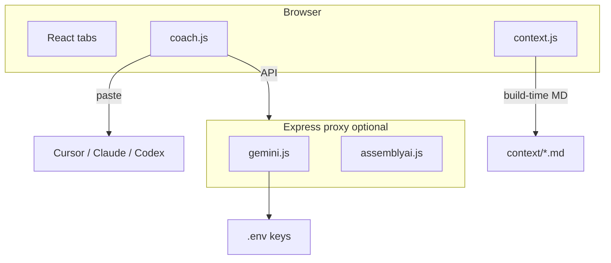

# Interview Prep Kit

A **local-first** interview prep app. Feed it your resume, job description, portfolio, and call notes — it generates stage-by-stage prep docs, behavioral flashcards, an audio record-and-coach loop, a prep advisor chat, and interview recording transcription. All grounded in **your** materials, not generic advice.

Works out of the box with **zero API keys** (paste mode). Optionally plug in Gemini and AssemblyAI for fully automated coaching.

---

## Features

| Tab | What it does |
|-----|--------------|
| **Prep Docs** | One doc per interview stage; editable notes; regenerate on demand |
| **Flashcards** | Behavioral / situational deck with AI coaching on your answers |
| **Audio** | Record answers out loud → transcribe → score structure and content |
| **Advisor** | Multi-turn chat; proposes flashcards and context updates you confirm |
| **Context** | Toggle, edit, and add grounding sources for every AI call |

---

## Quick start

```bash
git clone https://github.com/YOUR_USERNAME/interview-prep-kit.git
cd interview-prep-kit
npm install
npm run dev
```

Open **http://localhost:5173** in **Chrome** (required for Web Speech API in the Audio tab).

No API keys needed — the app defaults to **paste mode**.

---

## Customize for your interview

1. **Fill in `context/`** — six markdown files (resume, JD, portfolio, recruiter notes, intel, experiences). The more detail and metrics, the better outputs.
2. **Edit `interview.config.js`** — app title, role, company, your name, interview stages, advisor prompts.
3. **Run the drop-in prompt** — copy from [PROMPT.md](./PROMPT.md) into Cursor, Claude Code, Codex, or any AI assistant to regenerate `generated/` prep docs and flashcards grounded in your context.
4. **Restart dev server** after editing `context/` or `generated/` (Vite bundles them at build time).

---

## AI modes

### Paste mode (default)

No setup, no cost. Uses your existing Cursor / Claude / Codex subscription.

1. Toggle **AI: Paste mode** in the header (default).
2. Click **Regenerate** or **Coach me** — the app copies a full prompt (your context + task) to the clipboard.
3. Paste into your AI chat; paste the reply back into the app.

### API mode (optional)

Fully automated coaching loops via a local Express proxy. Keys stay server-side in `.env`.

```bash
cp .env.example .env
# Add GEMINI_API_KEY (https://aistudio.google.com/apikey)
npm run dev:api    # runs Vite + proxy together
```

Toggle **AI: API mode** in the header. Verify the proxy at http://localhost:3001/api/health.

---

## API keys

| Variable | Required? | Purpose |
|----------|-----------|---------|
| `GEMINI_API_KEY` | For API mode | Chat, coaching, audio scoring, transcription fallback |
| `GEMINI_MODEL` | Optional | Default `gemini-2.5-flash` — must support audio for tone scoring |
| `ASSEMBLYAI_API_KEY` | Optional | Speaker diarization on large interview recordings (>25 MB) |
| `PORT` | Optional | Express proxy port (default `3001`) |

- **Paste mode needs none of these.**
- **AssemblyAI** is an optional upgrade for Prep Docs → Recording uploads. Without it, Gemini handles transcription.
- **Never commit `.env`** — it's gitignored. Copy `.env.example` and add keys locally only.

---

## Swapping AI providers

The app is built around a single `coach()` function ([`src/lib/coach.js`](src/lib/coach.js)) with two backends:

- **Paste mode** — works with any external LLM (Cursor, Claude Code, Codex, ChatGPT, etc.)
- **API mode** — currently routes through [`server/gemini.js`](server/gemini.js) via [`server/index.js`](server/index.js)

To use a different provider in API mode, swap the implementation in `server/gemini.js` (or add a parallel module) and point the `/api/chat` and `/api/score-audio` handlers at it. The proxy pattern is ~30 lines — keys never reach the browser.

For transcription, see [`server/assemblyai.js`](server/assemblyai.js) and [`server/transcribe.js`](server/transcribe.js).

---

## Project structure

```
interview-prep-kit/
├── context/              # YOUR materials — source of truth for all AI grounding
│   ├── resume.md
│   ├── job-description.md
│   ├── portfolio.md
│   ├── recruiter-call.md
│   ├── intel.md
│   └── experiences.md
├── generated/            # Seed prep docs + flashcards (customize via PROMPT.md)
├── interview.config.js   # App title, stages, advisor prompt — edit after cloning
├── server/               # Express proxy (API mode only)
├── src/                  # React app
├── .env.example          # Copy to .env for API mode
└── PROMPT.md             # Drop-in prompt for AI-assisted customization
```

Every AI feature prepends your `context/` block. To improve any output, edit the markdown — no code changes required.

---

## Drop-in prompt (Cursor / Claude Code / Codex)

Copy everything below into a new chat after filling in `context/`:

```
You are helping me customize the interview-prep-kit template for my upcoming interview.

Read README.md and interview.config.js first. Then:

1. Read all files in /context/ — I have filled in my materials.
2. Update interview.config.js with my role, company, candidate name, interview stages
   (names, subtitles, regeneration prompts grounded in my pipeline).
3. Regenerate /generated/prep-*.md — one focused prep doc per stage using my context.
4. Regenerate /generated/flashcards.json — 20–25 role-specific questions with
   referenceAnswer + keyPoints grounded in my background.
5. Update advisor starter questions in interview.config.js to match my interviewers/stages.

Rules:
- Every output must cite MY metrics and stories from context/, not generic advice.
- Do not add or commit API keys.
- Do not remove paste mode or the coach() abstraction.
- Keep the app runnable with npm run dev after changes.
```

See [PROMPT.md](./PROMPT.md) for the same prompt as a standalone file you can `@`-mention.

---

## npm scripts

| Script | Command | When to use |
|--------|---------|-------------|
| `dev` | `vite` | Paste mode — frontend only |
| `dev:api` | `vite` + Express proxy | API mode with keys in `.env` |
| `build` | `vite build` | Production bundle → `dist/` |
| `preview` | `vite preview` | Preview production build |
| `server` | `node server/index.js` | Proxy only |

---

## Publishing your fork

- Keep personal content in `context/` and keys in `.env` — don't commit secrets.
- If you fork this template for your own prep, your repo can stay private.
- To contribute improvements back, open a PR against the public template.

### Use as a GitHub template

1. Click **Use this template** on GitHub (or fork).
2. Clone your copy, fill `context/`, run `npm install && npm run dev`.
3. Optionally enable **Settings → General → Template repository** on your fork if you want others to fork yours.

---

## Architecture



---

## License

MIT — see [LICENSE](./LICENSE).
